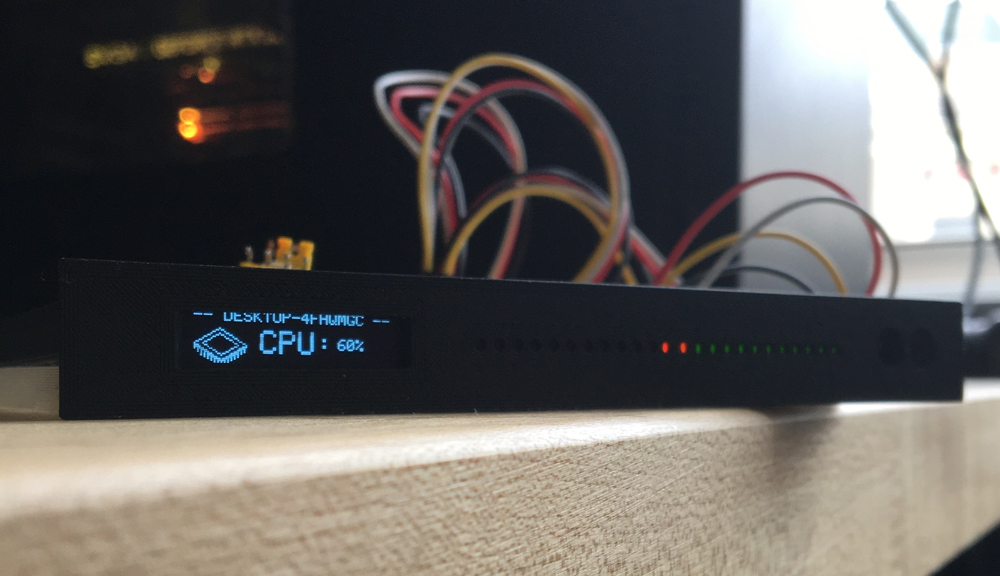
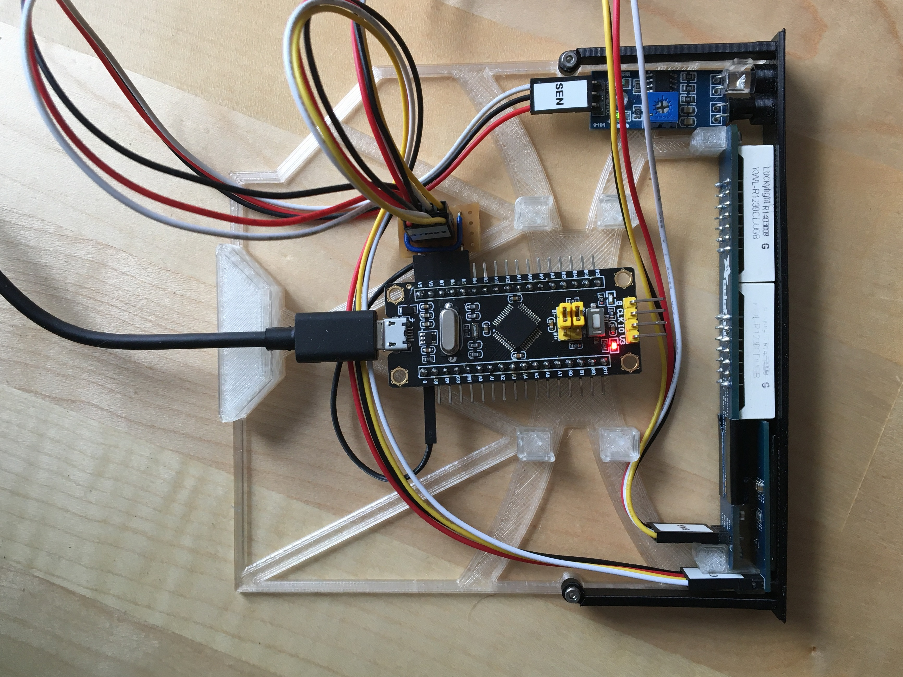
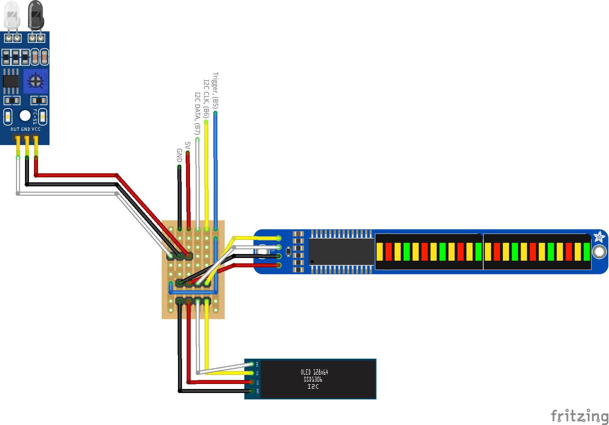

# NASMon


NASMon is an STM32 powered system monitor, powered by a Python backend.  Built for getting information quickly out of headless hardware, like a NAS.  Fully configurable through flexible YAML config with the ability to run commands on the host to get the information you want to see.

* Get stats through a **OLED display**, **bi-colour bargraph**.
* Display infomation with a hand-wave, using an **IR sensor** to trigger.
* **3D printable caddy** designed to slot into any  **slimline DVD drive**.
* Can be build at **low cost** with off-the-shelf peices.
* Flexible config allows for **images**, **text** and **bargraph data** to all be shown at once; no extra code required!

<p align="center">
  
</p>

<p align="center">
  
</p>

Some out of the box configs for monitoring:
* CPU usage [(example)](pages/cpu.yml)
* RAM usage [(example)](pages/ram.yml)
* Current internal/external IP [(example)](pages/cpu.yml)

Configuration is simple and flexible using YAML formatted 'pages'.  To scroll through all pages, hold your hand, (or any appendidge really) up to the the IR sensor.

## Example config


To display the current hostname:
```
name: "Hostname"

commands:
  - hostname: "hostname"
      # Windows: hostname
      # Mac: hostname
      # Linux: hostname
    run_once: true

text:
  - text: "-- {{hostname}} --"
    x: 0
    y: 0
    size: 1
```


## Getting Started
### Hardware (Todo)
Please see the ['Bill of Materials'](#BOM) table below for the required hardware.

**Step #1**
3D print the two components from the provided .stl files:
* Facia, (facia.stl)
* The chassis (chassis.stl)

**Step #2**
Solder up pins, (usually supplied) to:
* OLED
* Bargraph
* Microcontroller
* Proximity sensor

**Step #3**
* Fabricate the connector board; the electronics is designed to fit inside a laptop-sized optical bay:
<p align="left">
  
</p>

### Firmware
Firmware can be uploaded to the STM32 board a number of ways, (flash a USB bootloader, serial, ST-LINK).  I found using an ST-LINK v2 Adaptor to be the easiest; clones can be picked up cheaply from eBay or Amazon.  PlatformIO plays nicely with these adaptors - see the [plaformio.ini config](platformio.ini) file for an example configuration.
### Software

Dependancy mangement/venv is handled by Poetry.  For more details on Poetry and how to install it, see [this guide](https://python-poetry.org/docs/).

```
# Pull down the repo
git clone https://github.com/alexpeissel/NASMon.git
cd NASMon

# Install Poetry
curl -sSL https://raw.githubusercontent.com/python-poetry/poetry/master/get-poetry.py | python -

# Get dependencies
poetry install

# Run the host
poetry run python nasmon.py --config .\config.yaml --debug
```

### BOM

The NASMon hardware is made completely out of off-the-shelf items:


| Name                                  | Function               | Notes                                                                               | Link                                                                                                                                                    | Cost       |
|---------------------------------------|------------------------|-------------------------------------------------------------------------------------|---------------------------------------------------------------------------------------------------------------------------------------------------------|------------|
| STM32 'Blackpill' Development Board   | Microcontroller        | Based on the STM32F103C8T6 uC; could probably replaced with any of the STM32 family | https://www.amazon.co.uk/Hobby-Components-Ltd-STM32F103-Development/dp/B07QCQCDXL/ref=sr_1_5?dchild=1&keywords=black+pill&qid=1615919343&sr=8-5         | £5.99      |
| Adafruit Bi-Color 24-Bar LED Bargraph | Bi-colour LED bargraph | I2C LED bargraph controlled by a MAX7219                                            | https://thepihut.com/products/adafruit-bi-color-red-green-24-bar-bargraph-w-i2c-backpack-kit                                                            | £9.00      |
| SSD1306 I2C OLED display, (128 x 32)  | OLED display           | Can be picked up very cheaply from eBay                                             | https://www.ebay.co.uk/itm/128X32-0-91-OLED-module-White-Display-Module-for-Arduino-SSD1306-I2C-IIC/233734877063?hash=item366baf2f87:g:AoMAAOSwa1xfgG8z | ~£3.85     |
| IR proximity sensor                   | User input             | Can also be picked up for peanuts                                                   | https://www.ebay.co.uk/itm/Infrared-Proximity-Sensor-IR-Infrared-Obstacle-Avoidance-Sensor-Module/224022537140                                          | ~£2.86     |
| ST-Link V2 programmer for STM32       | Chip programmer        | The most plug-and-play way to program as STM32 uC that I have found                 | https://www.amazon.co.uk/ICQUANZX-ST-Link-Programming-Emulator-Downloader/dp/B07YX83NSL                                                                 | £7.99      |
| Wire                                  | Wire                   | Female to female DuPont cables work nicely                                          |                                                                                                                                                         |            |
| **Total**                             |                        |                                                                                     |                                                                                                                                                         | **£29.69** |


## License

This project is licensed under the MIT License - see the [LICENSE.md](LICENSE.md) file for details


## Acknowledgments

* [Keybon - great looking multi-OLED control deck that put me on to using an STM32 and the USBComposite library](https://github.com/CoretechR/Keybon)
